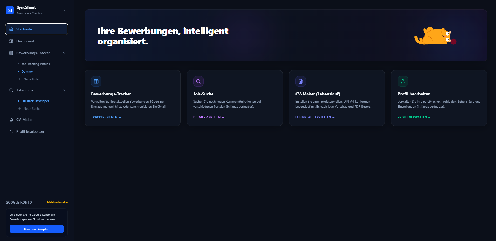
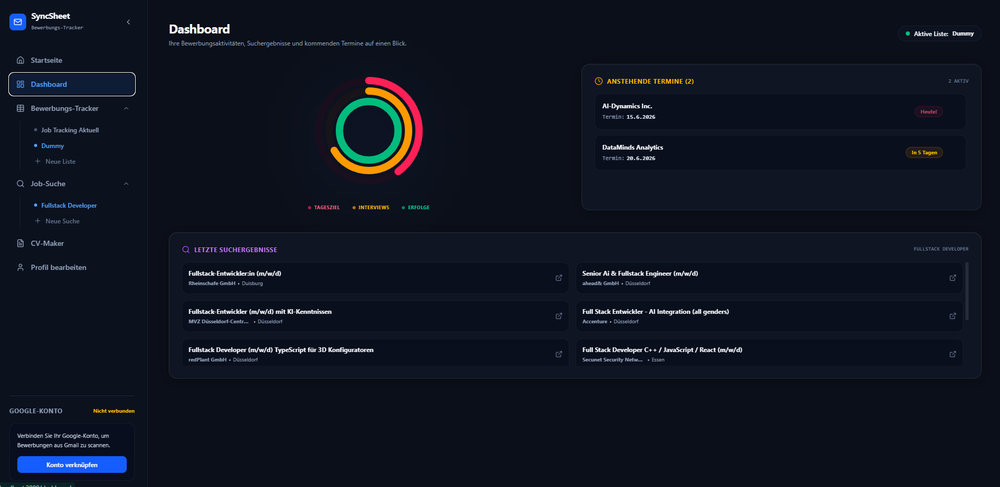
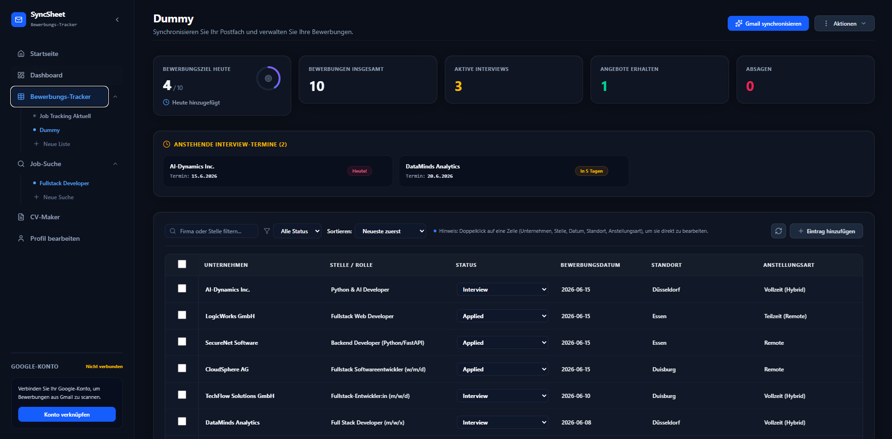
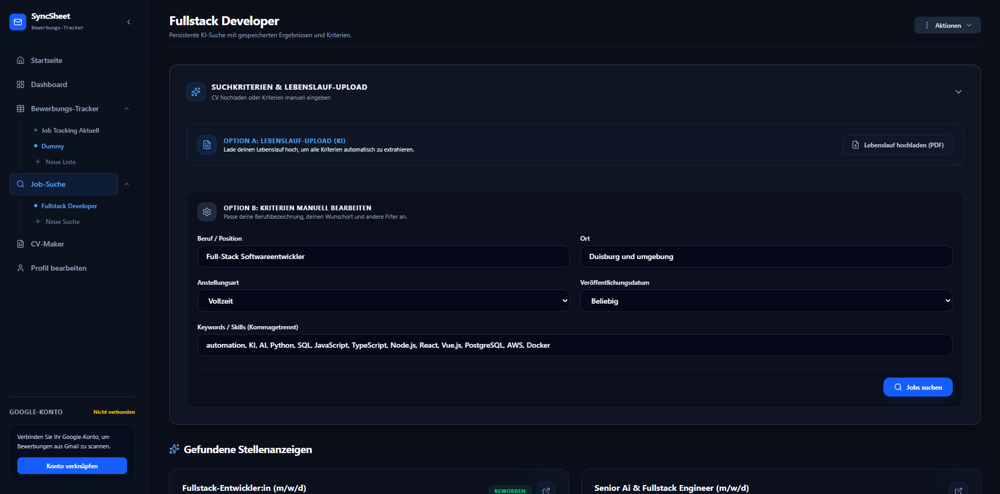
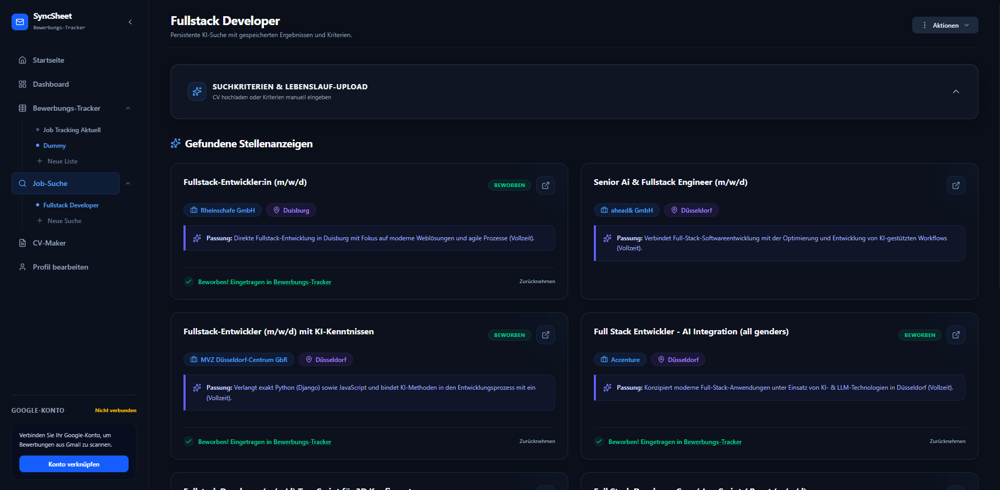
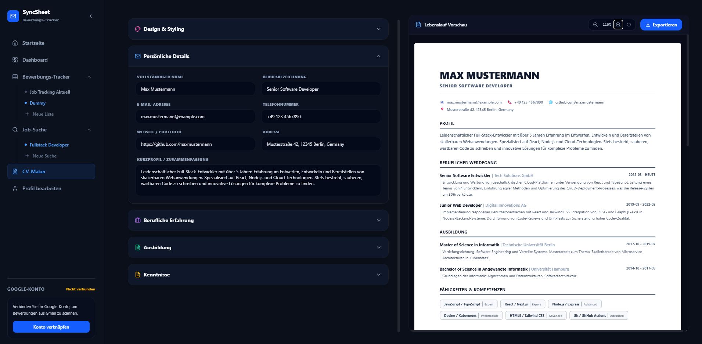

# 💼 SyncSheet — Job Application Tracker

SyncSheet ist die ultimative All-in-One-Plattform zur Organisation, Verwaltung und Automatisierung deiner Jobsuche. Entwickelt für moderne Professionals, vereint SyncSheet smarte Gmail-Integration, KI-gestützte Stellenanalyse, einen professionellen Lebenslauf-Designer und interaktive Dashboards in einer nahtlosen Fullstack-Anwendung.

---

## 🌟 Hauptfunktionen & Pages

### 1. 🏠 Startseite (Home)
Der zentrale Einstiegspunkt in deine Jobsuche. Hier erhältst du einen schnellen Überblick und direkten Zugriff auf alle Kernbereiche der Anwendung.

---

### 2. 📊 Dashboard
Verfolge deinen Fortschritt wie ein Sportziel! 
* **Aktivitätsringe:** Konzentrische Ringe zeigen dir auf einen Blick dein Tagesziel, deine anstehenden Interviews und deine Erfolgsquote (Zusagen).
* **Terminplaner:** Automatisch verwaltete Interview-Termine und Erinnerungen.

---

### 3. 📥 Job-Tracker & Gmail-Sync
Das Herzstück deiner Bewerbungsorganisation.
* **Intelligenter Gmail-Import:** Verbinde dein Gmail-Konto und lasse die integrierte Gemini-KI deine Posteingänge nach Bewerbungsstatus und Aktualisierungen scannen (z. B. Bestätigungen, Einladungen, Absagen).
* **Interaktive Tabellen:** Verwalte deine Bewerbungen in einer hochflexiblen Tabelle. Bearbeite Einträge direkt per Doppelklick und passe Spaltenbreiten individuell an.
* **Multi-Tabellen-Support:** Erstelle, benenne und lösche verschiedene Listen/Tabellen (z. B. für unterschiedliche Berufsfelder oder Importe).

---

### 4. 🔍 Jobsuche & KI-Matching
Finde die passenden Stellenangebote direkt in der App.
* **Live-Suche:** Echtzeit-Stellensuche auf Premium-Jobportalen.
* **KI-Matching:** Die Gemini-API analysiert die Übereinstimmung der gefundenen Stellen mit deinem Profil und liefert dir eine präzise, schriftliche Begründung, warum die Stelle zu dir passt.

---

### 5. 📄 Lebenslauf-Generator (CV Maker)
Erstelle im Handumdrehen einen überzeugenden, professionellen Lebenslauf.
* **Live-A4-Vorschau:** Sieh deine Änderungen in Echtzeit in einer präzisen Druckvorschau.
* **Flexibles Design:** Wähle aus verschiedenen professionellen Farbthemen und Schriftarten.
* **Direktdruck:** Lade deinen Lebenslauf direkt als PDF herunter oder drucke ihn aus dem Browser heraus.

---

## 🛠️ Schnellstart für Entwickler

Möchtest du das Projekt lokal ausführen oder weiterentwickeln? Alle technischen Details, die Systemarchitektur sowie Installationsanweisungen findest du in meiner ausführlichen Entwickler-Dokumentation:

👉 **[Zur Entwickler-Dokumentation](docs/developer_documentation.md)**
